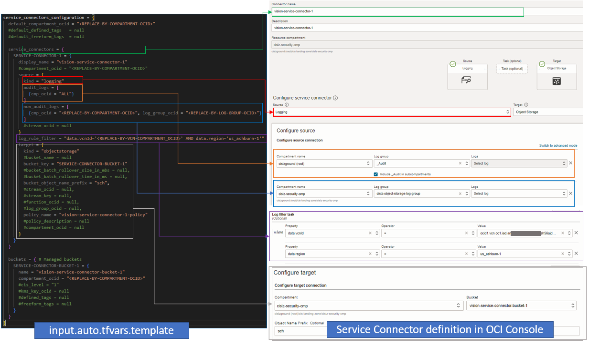

# CIS OCI Service Connectors Module Example - Vision service connectors

## Introduction

This example shows how to deploy service connectors in OCI for a hypothetical Vision entity. 

It deploys one service connector with the following characteristics:
- Captures logging data from audit logs tenancy wide.
- Captures logging data from other logs than audit logs from an specific compartment and log group.
- Filters captured logging data by VCN ocid and region.
- Consolidates captured data in an Object Storage bucket, that is managed in the same configuration.

An Identity and Access Management (IAM) policy is implicitly deployed in the tenancy home region, granting the Service Connector service rights to push data to the Object Storage bucket.

The picture below shows side by side how the various attributes in *service_connectors_configuration* variable within *input.auto.tfvars.template* map to the service connector definition in OCI (as shown in OCI Console). 



## Using this example
1. Rename *input.auto.tfvars.template* to *\<project-name\>.auto.tfvars*, where *\<project-name\>* is any name of your choice.

2. Within *\<project-name\>.auto.tfvars*, provide tenancy connectivity information and adjust the *service_connectors_configuration* input variable, by making the appropriate substitutions:
   - Replace *\<REPLACE-BY-COMPARTMENT-OCID\>* placeholders by appropriate compartment OCIDs. 
   - Replace *\<REPLACE-BY-LOG_GROUP-OCID\>* placeholder by appropriate log group OCID. 
   - Replace *\<REPLACE-BY-VCN-COMPARTMENT-OCID\>* placeholder by appropriate compartment OCID, if filtering logging data.

Refer to [Service Connectors module README.md](../../README.md) for overall attributes usage.

3. In this folder, run the typical Terraform workflow:
```
terraform init
terraform plan -out plan.out
terraform apply plan.out
```